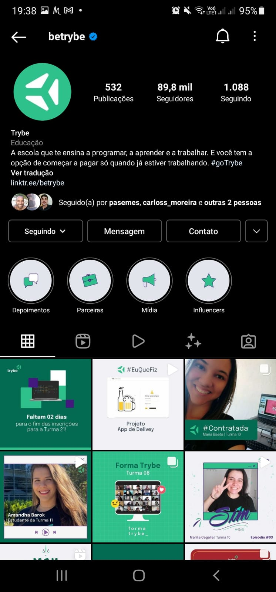
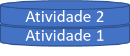
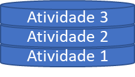
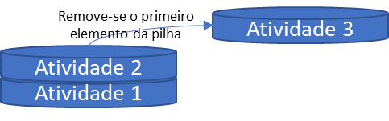
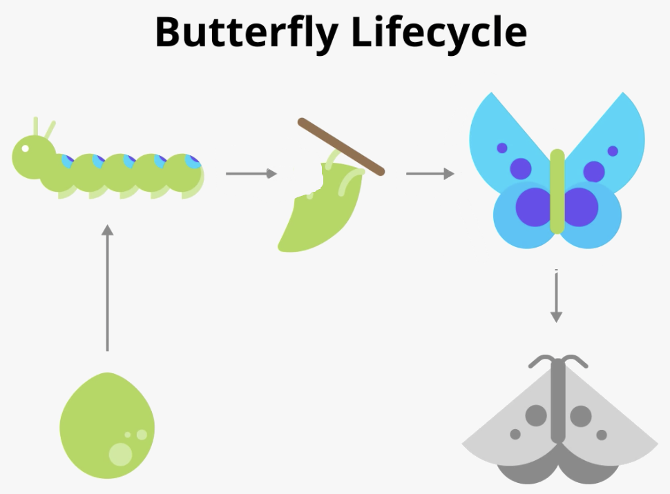

Todo material aqui disposto **não referenciado**, incluido vídeos, códigos de exemplos no github e imagens são de autoria de [Pierre Vieira](https://github.com/PierreVieira).

# Activity

A ideia deste capítulo é lhe introduzir à classe Activity do Android seguindo o seguinte roteiro:

- [Pré requisitos]()
- [Introdução]()
   - [O que é uma Activity?]()
       - [Toda tela é uma Activity?]()
       - [A definição mais precisa para uma Activity]()
- [Pilha de navegação]()
- [Ciclo de vida de uma Activity]()
- [Recuperando estado de uma Activity]()
- [Exercícios]()

## Pré Requisitos
Para absorver esse conteúdo é recomendado que você já saiba como criar um projeto no android studio, bem como entender os principais conceitos de programação orientada a objetos com Kotlin.
Caso você ainda não esteja familiarizado(a) com esses itens, segue nossas recomendações:
- [Bootcamp de Kotlin - Google](https://developer.android.com/courses/kotlin-bootcamp/overview?hl=pt-br)
- [Como criar um projeto Android Studio](https://developer.android.com/training/basics/firstapp/creating-project?hl=pt-br)

## Introdução
Se você está iniciando no mundo de desenvolvimento Android, com certeza não tem como não esbarrar no assunto de activities / atividades.
A classe Activity é uma parte fundamental para uma aplicação Android, entender como esse componente funciona facilita muito para que você tenha um entendimento melhor de como uma aplicação mobile (mesmo que não seja em Android nativo) se comporta.

## O que é uma activity?
### Toda tela é uma Activity?
Uma forma "ultrapassada" de definir formalmente uma atividade é dizer que ela representa uma tela do aplicativo.
Entretanto, essa afirmação vem caindo em desuso desde que a preocupação com [clean code](https://youtu.be/ln6t3uyTveQ) e modelos de arquitetura para a [UI](https://developer.android.com/guide/topics/ui?hl=pt-br)
começaram a ser mais discutidos pela comunidade Android. Esse modelo de definição começou a ser ainda mais questionado a partir do surgimento do componente de navegação do Jetpack.
Em que as telas, não são mais definidas por activities, mas sim por fragmentos (plural traduzido de Fragment).

Nessa parte do curso não daremos muito foco aos fragmentos e nem no componente de navegação do Jetpack, mas caso queira entender melhor o
assunto, após estudar esse capítulo, recomendamos [esse vídeo](https://youtu.be/2k8x8V77CrU) referente ao Android Dev Summit '18, onde esse tema foi mais abordado pela Google.

### A definição mais precisa para uma Activity
Após essa série de considerações podemos finalmente definir o que é uma acitvity: uma atividade (ou activity) é o ponto de entrada para a interação de um aplicativo com o usuário.

Essa definição pode ter ficado um pouco confusa, mas vamos pensar na prática:

Caso tenha o aplicativo do Instagram instalado no seu telefone, experimente abrir esses 3 links diretamente no seu dispositivo (quando solicitado informe que quer abrir o link pelo app do Instagram):
- [Link 1](https://www.instagram.com/)
- [Link 2](https://www.instagram.com/betrybe/)
- [Link 3](https://www.instagram.com/p/CWMDqoyjf35/)

> Dica: Se o link estiver abrindo diretamente no seu navegador sem te perguntar se você quer abrir diretamente no Instagram
> copie os links e cole um por um em algum editor de texto no seu celular (pode ser um chat qualquer do whatsapp),
> tente clicar novamente no link: agora ele provavelmente irá perguntar por onde você quer abrir o app, escolha o Instagram. 

Se você realizou o experimento proposto deve ter percebido que, apesar de, nos 3 links, o aplicativo aberto ter sido o mesmo (Instagram),
foram abertas telas diferentes:

<table>
    <thead align="center">
        <tr>
            <td><strong>Primeiro Link</strong></td>
            <td><strong>Segundo Link</strong></td>
            <td><strong>Terceiro Link</strong></td>
        </tr>
    </thead>
    <tbody>
        <tr>
            <td></td>
            <td></td>
            <td></td>
        </tr>
    </tbody>
</table>

Quando você clicou em um desses links pelo seu smartphone, o aplicativo que estava com o link fez uma solicitação para inicializar uma atividade do Instagram.

Faça mais um experimento:
Caso o Instagram ainda esteja aberto, feche-o e abra novamente o terceiro link, após isso pressione o botão voltar do sistema:
Você vai perceber que, diferentemente do que ocorre em um navegador, o botão de voltar, nesse caso irá voltar para o aplicativo anterior, em vez de voltar para uma outra tela do Instagram (o que seria esperado se estivesse pelo navegador).

Com isso você consegue perceber que, diferentemente de um programa que foi projetado para executar em um sistema operacional desktop, um aplicativo nem sempre começa a experiência do usuário no mesmo lugar. Dizemos então, que a jornada do usuário começa de maneira não deterministica.
A classe `Activity` foi, dessa forma, projetada para facilitar esse paradigma.

**OBS:** Veremos em capítulos posteriores, durante o curso, como funciona internamente esse pedido de um app pedir para inicializar atividades de outros apps com os chamados _intents_, mas por enquanto atente-se apenas no fato de que isso é possível e que a atividade representa o início dessa chamada.

## Pilha de Atividades
Apesar de, no item anterior, termos falado que definir uma atividade simplesmente dizendo que "representa uma tela" é
uma definição que está caindo em desuso, vamos considerar essa definição para esse item, pois muitos apps ainda utilizam essa
abordagem para fazer navegação. Ainda que um aplicativo não use mais esse paradigma, entender como funciona uma pilha de navegação
é algo essencial para qualquer desenvolvedor android, e isso podemos estudar com atividades 😉

Então, considerando no nosso exemplo, em que cada tela é representada por uma atividade diferente, veja o seguinte vídeo:

https://user-images.githubusercontent.com/49538805/144770412-d32e5fa3-10bd-445b-9cf1-4912f3290df6.mp4

Você percebe que isso é apenas um simples app que navega entre 3 telas (no nosso caso também pode ser entendido como 3 activities),
mas que tal entender como isso realmente funciona por debaixo dos panos? 🤔

Nesse caso o sistema Android utiliza uma estrutura de dados chamada pilha para controlar a navegação.
O foco desse capítulo não é explorar o funcionamento e a implementação de uma [pilha](https://pt.wikipedia.org/wiki/Pilha_(inform%C3%A1tica)), mas podemos resumir uma pilha como
uma estrutura em que o primeiro elemento a ser inserido será o último a ser removido.

> Pense em uma pilha de pratos, geralmente o primeiro prato a ser removido dessa pilha é o último prato que foi inserido.

No nosso exemplo podemos pensar em uma representação gráfica com algo do tipo:

Ao inicializar o aplicativo temos somente 1 atividade na pilha:

Ao navegar da primeira atividade para a segunda atividade, colocamos mais um item na pilha:

Ao navegar da segunda atividade para a terceira atividade, estamos colocando mais um item na pilha:

Quando pressionamos o botão de voltar estamos removendo a atividade do topo da pilha

Nesse caso voltamos a ter uma pilha com 2 atividades:

E assim podemos ir navegando pelo app que o sistema Android irá manipular a navegação através das pilhas.

## Ciclo de Vida
Toda atividade tem aquilo que chamamos de _ciclo de vida_. Essa é uma alusão aos ciclos de vida de animais e vegetais,
como, por exemplo, uma borboleta, que nasce, se desenvolve passando desde seu estado embrionário até a vida adulta e depois morre.

_Imagem retirada do codelab da google sobre desenvolvimento Android_

